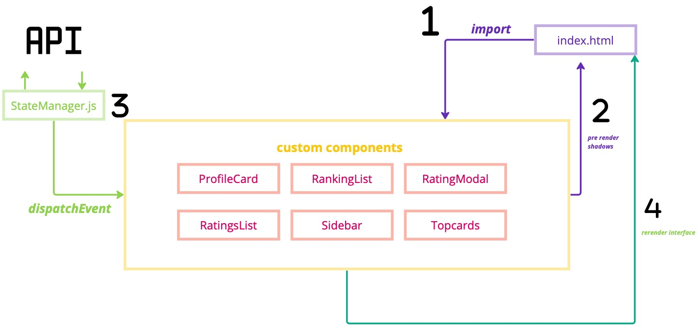
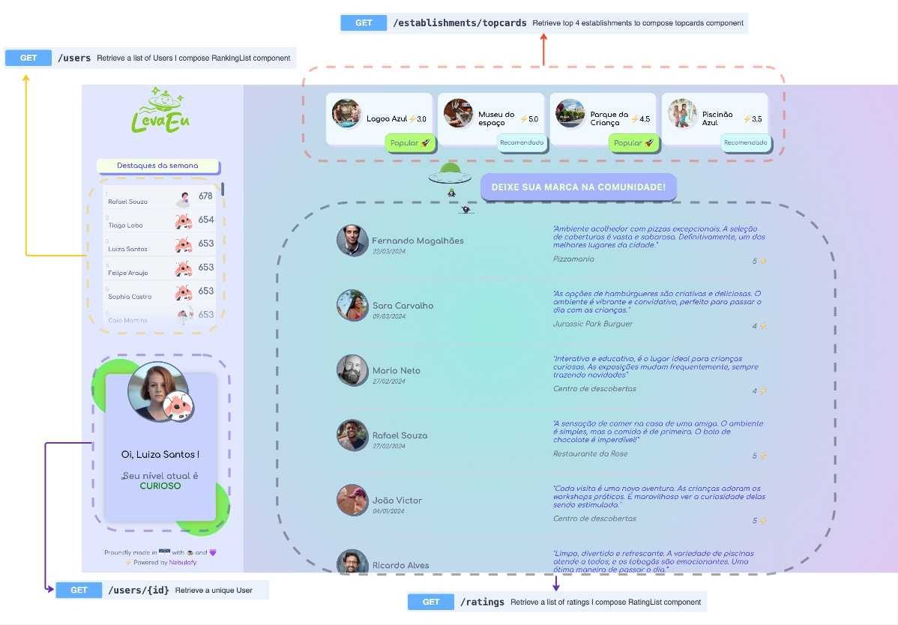
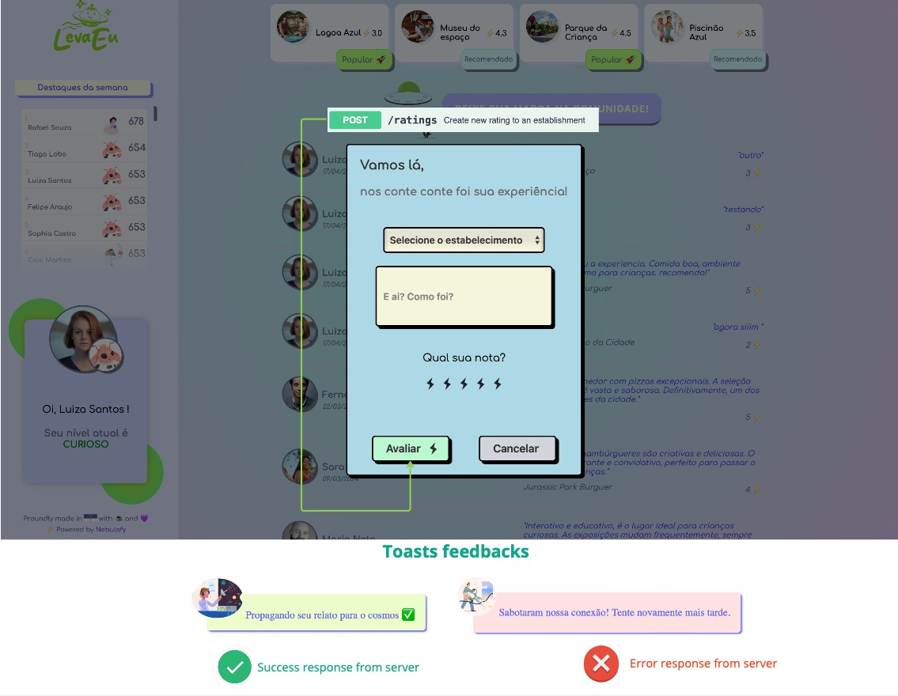

# LevaEu


The frontend of the LevaEu platform is designed to be user-friendly, ensuring a smooth navigation experience for our users. It incorporates attractive layouts and interactive elements to enhance user engagement. It is being developed using pure HTML, CSS and VanillaJS. 

## Prerequisites to follow the application: 

To clone this repository to your local machine, follow these steps:

1. Open your terminal.
2. Change the current working directory to the location where you want the cloned directory.
3. Type the following git command and press Enter:
    ```bash
    git clone https://github.com/gabrielsacampos/levaeu-front.git
    ```
4. This will create a local copy of the repository in your desired directory.

#### Running the project on your local machine:

1. Navigate to the project directory:
      ```bash
    cd levaeu-front
    ```

2. Ensure that the server is running by following the instructions provided in the backend documentation [here](https://github.com/gabrielsacampos/levaeu-back).

3. Once the server is confirmed to be running, open the project with browser:
    ```bash
    open index.html
    ```


### Architecture:

At the core of our application is the StateManager, which handles HTTP communications with the backend (more details [here](https://github.com/gabrielsacampos/levaeu-back)). It is responsible for:

- Fetching data from the backend.
- Dispatching events that carry the fetched data.

Components within the application subscribe to these events to update the user interface, creating a interactive experience.



### Key Components:
Let's dive into our components and their features:

- __Topcards:__
    This component displays a curated list of establishments, highlighting those tagged as "popular" or "advertising". The "advertising" tag not only helps in sorting establishments but also serves as a revenue generation tool by promoting certain locations.


- __Ranking__:
    Located in the sidebar, this section ranks the most active users based on their weekly interactions. It displays:

    * User rankings.
    * Scores.
    * Current archetypes.

- __Profile Card__: 
    The Profile Card welcomes users with a personalized greeting and displays their current archetype, fostering a personalized user experience.

- __Rating List__:
    Retrieves and displays the latest user reviews of establishments, keeping the content fresh and relevant.




- __Rating Modal__:
    Enables users to provide feedback on their experiences at establishments. Users are prompted to:
    * Fill out text inputs.
    * Choose from various options.
    * Use a bolt rating system to reflect their satisfaction level.

- __Toasts__:
    Toast notifications inform users about the status of their actions, such as successful submission of a review or errors encountered during the process.





